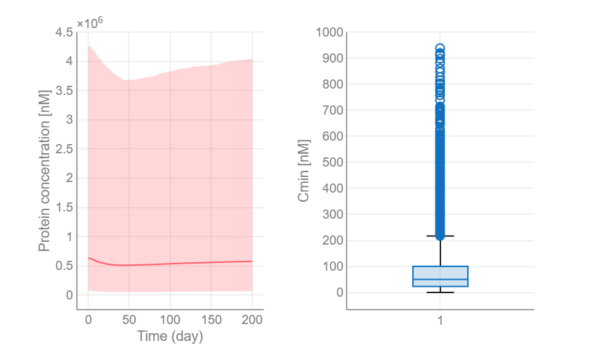
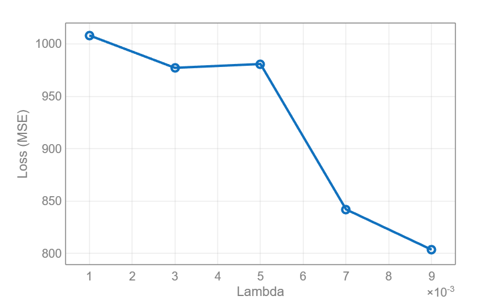
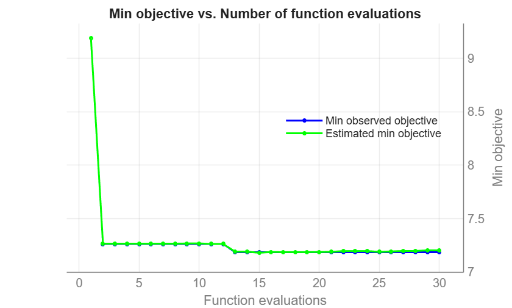
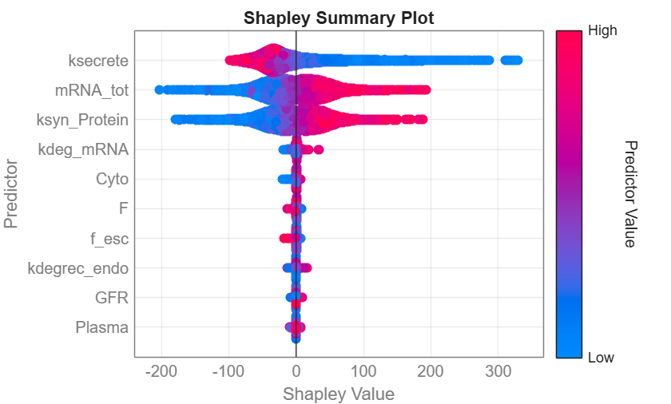
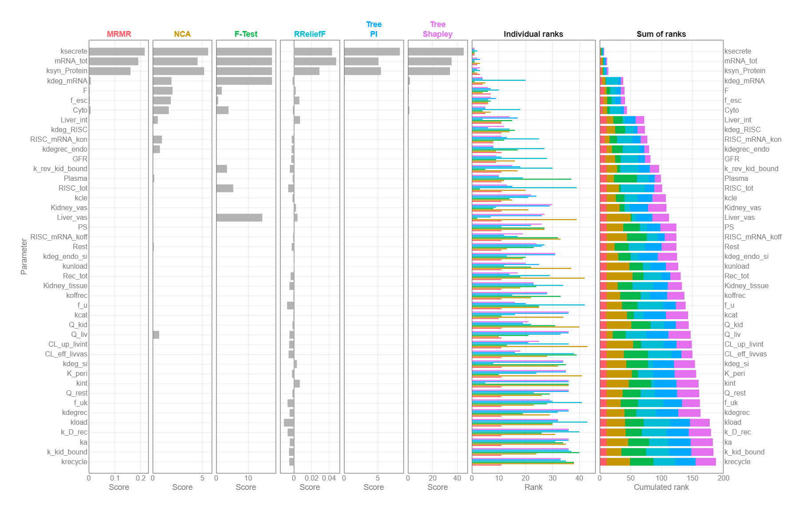
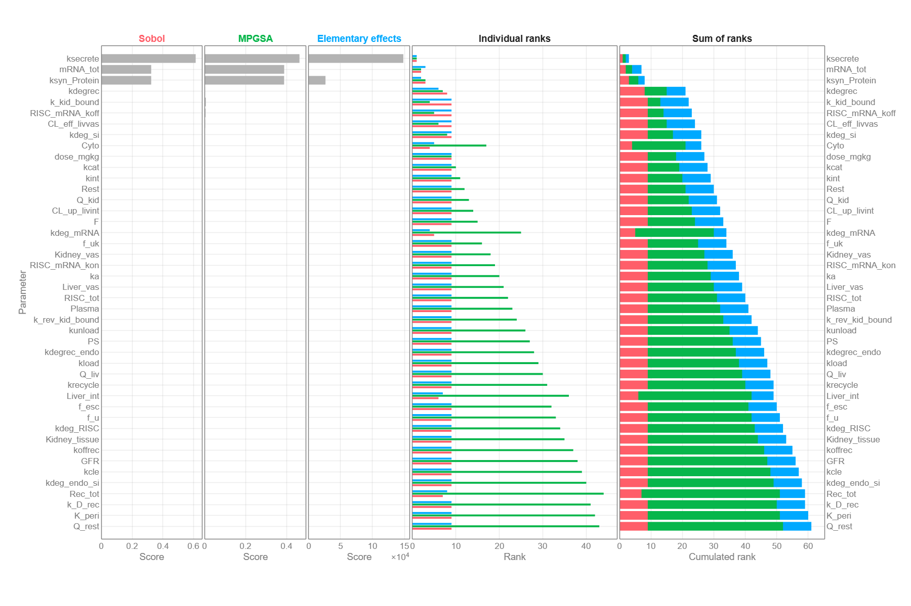
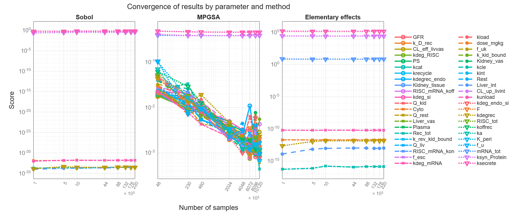

<a id="TMP_63a1"></a>

# Feature ranking as a pre\-screening method for QSP models

<!-- Begin Toc -->

## Table of Contents
&#8195;[Preparation](#TMP_8c0a)
 
&#8195;[Determination of input parameters](#H_65515706)
 
&#8195;[Generate parameter samples](#TMP_2559)
 
&#8195;[Run simulations](#TMP_0b04)
 
&#8195;[Format simulation results](#TMP_1d24)
 
&#8195;[Check output variance](#TMP_1c71)
 
&#8195;[Run feature ranking methods](#TMP_9aa9)
 
&#8195;&#8195;[Neighborhood Component Analysis (NCA)](#TMP_6126)
 
&#8195;&#8195;[Minimum Redundancy Maximum Relevance (MRMR)](#TMP_2dd1)
 
&#8195;&#8195;[F\-Test](#TMP_2245)
 
&#8195;&#8195;[RReliefF](#TMP_1fc1)
 
&#8195;&#8195;[Predictor importance on trained decision tree](#TMP_3ade)
 
&#8195;&#8195;[Shapley values](#TMP_1785)
 
&#8195;[Results summary](#TMP_10e4)
 
&#8195;[Compare with GSA](#TMP_8e91)
 
<!-- End Toc -->
<a id="TMP_8c0a"></a>

# Preparation
```matlab
try
    isOnline = matlab.internal.environment.context.isMATLABOnline;
    if ~isOnline && isempty(gcp("nocreate"))
        parpool("Processes");
    end
catch
end
```

```matlabTextOutput
Starting parallel pool (parpool) using the 'Processes' profile ...
16-Jul-2026 15:13:05: Connected to 7 of 8 parallel pool workers.
16-Jul-2026 15:14:05: Connected to 7 of 8 parallel pool workers.
Connected to parallel pool with 8 workers.
```

Load model from SimBiology project

```matlab
s = sbioloadproject("mPBPK_siRNA.sbproj","m1");
model = s.m1
```

```matlabTextOutput
model = 
   SimBiology Model - human_vutr 


   Model Components:
     Compartments:      7
     Events:            0
     Parameters:        60
     Reactions:         31
     Rules:             24
     Species:           21
     Observables:       4


```

<a id="H_65515706"></a>

# Determination of input parameters

To determine which parameters we should sample from to generate a variety of response values, we will first list all free parameters in the model. These parameters should be constant and not defined by any initial assignments. 

```matlab
inputObj = getFreeParameters(model);
inputObj = removeObjZeroValue(inputObj);
inputObj = removeObjByName(inputObj,"mw");        % Molecular Weight
inputObj = removeObjByName(inputObj,"dose_mgkg"); % Dose amount in mg/kg


inputPars = cell2table(get(inputObj,{'Type','Name','Value'}), VariableNames={'Type','Name','Value'});
inputPars = convertvars(inputPars,"Type","categorical")
```

| |Type|Name|Value|
|:--:|:--:|:--:|:--:|
|1|compartment|'Kidney_vas'|0.0182|
|2|compartment|'Liver_int'|0.4290|
|3|compartment|'Rest'|12.3940|
|4|compartment|'Kidney_tissue'|0.2960|
|5|compartment|'Cyto'|1.3710|
|6|compartment|'Plasma'|3.1260|
|7|compartment|'Liver_vas'|0.1830|
|8|parameter|'Q_kid'|36.4020|
|9|parameter|'Q_liv'|47.8440|
|10|parameter|'K_peri'|0.1000|
|11|parameter|'f_u'|0.1500|
|12|parameter|'CL_eff_livvas'|28.3100|
|13|parameter|'ka'|0.0600|
|14|parameter|'k_rev_kid_bound'|0.0200|

<a id="TMP_2559"></a>

# Generate parameter samples 

We will use uniform distribution and set the bounds so as to have one order of magnitude between lower and upper bound.

```matlab
Nsamples = 10^4;


distObj = arrayfun(@(x) makedist("Uniform","lower",x*10^-0.5,"upper",x*10^0.5), inputPars.Value);
scen = SimBiology.Scenarios(inputPars.Name, distObj, Number=Nsamples, SamplingMethod='sobol');
scen = scen.add('cartesian','dose_mgkg',1);
```

<a id="TMP_0b04"></a>

# Run simulations

Create SimFunction to return `Cmin` as output.

```matlab
observableName = ["Cyto.Protein","Cmin"]; 
dose = model.getdose("single dose");
variant = [];


simfun = model.createSimFunction(scen, observableName, dose, variant, UseParallel=true)
```

```matlabTextOutput
Warning: Reported from Dimensional Analysis:
Unable to perform dimensional analysis for observable 'Cmin' because of the function 'min' in the observable. Because UnitConversion is on, correct simulation results will depend on this expression being dimensionally correct. Additionally, SimBiology simulates the model in a unit system determined at runtime. The units are determined by the units used in the model and the model's configset. Unless the inputs and outputs to the function are dimensionless, results may change due to configset option changes, changes to the model, or version changes in SimBiology. It is recommended that input and output arguments to functions be dimensionless to ensure correct results.


Warning: Reported from Dimensional Analysis:
Unable to perform dimensional analysis for observable 'Cmin' because of the function 'min' in the observable. Because UnitConversion is on, correct simulation results will depend on this expression being dimensionally correct. Additionally, SimBiology simulates the model in a unit system determined at runtime. The units are determined by the units used in the model and the model's configset. Unless the inputs and outputs to the function are dimensionless, results may change due to configset option changes, changes to the model, or version changes in SimBiology. It is recommended that input and output arguments to functions be dimensionless to ensure correct results.


simfun = 
SimFunction:Parallel


Parameters:


           Name             Value          Type                      Units            
    ___________________    _______    _______________    _____________________________


    {'Kidney_vas'     }     0.0182    {'compartment'}    {'liter'                    }
    {'Liver_int'      }      0.429    {'compartment'}    {'liter'                    }
    {'Rest'           }     12.394    {'compartment'}    {'liter'                    }
    {'Kidney_tissue'  }      0.296    {'compartment'}    {'liter'                    }
    {'Cyto'           }      1.371    {'compartment'}    {'liter'                    }
    {'Plasma'         }      3.126    {'compartment'}    {'liter'                    }
    {'Liver_vas'      }      0.183    {'compartment'}    {'liter'                    }
    {'Q_kid'          }     36.402    {'parameter'  }    {'liter/hour'               }
    {'Q_liv'          }     47.844    {'parameter'  }    {'liter/hour'               }
    {'K_peri'         }        0.1    {'parameter'  }    {'dimensionless'            }
    {'f_u'            }       0.15    {'parameter'  }    {'dimensionless'            }
    {'CL_eff_livvas'  }      28.31    {'parameter'  }    {'liter/hour'               }
    {'ka'             }       0.06    {'parameter'  }    {'1/hour'                   }
    {'k_rev_kid_bound'}       0.02    {'parameter'  }    {'1/hour'                   }
    {'Q_rest'         }     97.677    {'parameter'  }    {'liter/hour'               }
    {'CL_up_livint'   }      80.53    {'parameter'  }    {'liter/hour'               }
    {'k_kid_bound'    }        0.7    {'parameter'  }    {'1/hour'                   }
    {'kdeg_mRNA'      }       0.04    {'parameter'  }    {'1/hour'                   }
    {'kcat'           }        400    {'parameter'  }    {'1/hour'                   }
    {'RISC_tot'       }         30    {'parameter'  }    {'nanomole/liter'           }
    {'kdegrec'        }       0.04    {'parameter'  }    {'1/hour'                   }
    {'kunload'        }      9e-06    {'parameter'  }    {'1/hour'                   }
    {'ksecrete'       }     0.0096    {'parameter'  }    {'1/hour'                   }
    {'mRNA_tot'       }       3890    {'parameter'  }    {'nanomole/liter'           }
    {'kint'           }     0.3287    {'parameter'  }    {'1/hour'                   }
    {'kload'          }       0.01    {'parameter'  }    {'1/((nanomole/liter)*hour)'}
    {'Rec_tot'        }        340    {'parameter'  }    {'nanomole/liter'           }
    {'kdeg_RISC'      }    0.00031    {'parameter'  }    {'1/hour'                   }
    {'f_esc'          }       0.02    {'parameter'  }    {'dimensionless'            }
    {'kcle'           }       1.32    {'parameter'  }    {'1/hour'                   }
    {'RISC_mRNA_koff' }      1e-07    {'parameter'  }    {'1/hour'                   }
    {'f_uk'           }       0.07    {'parameter'  }    {'dimensionless'            }
    {'kdegrec_endo'   }       1.53    {'parameter'  }    {'1/hour'                   }
    {'RISC_mRNA_kon'  }     0.0923    {'parameter'  }    {'1/((nanomole/liter)*hour)'}
    {'GFR'            }     36.319    {'parameter'  }    {'liter/hour'               }
    {'PS'             }     19.296    {'parameter'  }    {'liter/hour'               }
    {'kdeg_endo_si'   }     0.0011    {'parameter'  }    {'1/hour'                   }
    {'koffrec'        }       1.32    {'parameter'  }    {'1/hour'                   }
    {'kdeg_si'        }       0.05    {'parameter'  }    {'1/hour'                   }
    {'ksyn_Protein'   }     0.9878    {'parameter'  }    {'1/hour'                   }
    {'krecycle'       }       13.8    {'parameter'  }    {'1/hour'                   }
    {'F'              }       0.43    {'parameter'  }    {'dimensionless'            }
    {'k_D_rec'        }       2.48    {'parameter'  }    {'nanomole/liter'           }
    {'dose_mgkg'      }        100    {'parameter'  }    {'milligram'                }


Observables: 


          Name               Type               Units       
    ________________    ______________    __________________


    {'Cyto.Protein'}    {'species'   }    {'nanomole/liter'}
    {'Cmin'        }    {'observable'}    {'nanomole/liter'}


Dosed: 


          TargetName                    TargetDimension                   Amount          AmountValue    AmountUnits 
    ______________________    ___________________________________    _________________    ___________    ____________


    {'Plasma.Dose_plasma'}    {'Amount (e.g., mole or molecule)'}    {'dose_nanomole'}         0         {'nanomole'}


TimeUnits: day
```

```matlab
simfun.accelerate();
```

Run simulations

```matlab
inputs = scen.generate()
```

| |Kidney_vas|Liver_int|Rest|Kidney_tissue|Cyto|Plasma|Liver_vas|Q_kid|Q_liv|K_peri|f_u|CL_eff_livvas|ka|k_rev_kid_bound|Q_rest|CL_up_livint|k_kid_bound|kdeg_mRNA|kcat|RISC_tot|kdegrec|kunload|ksecrete|mRNA_tot|kint|kload|Rec_tot|kdeg_RISC|f_esc|kcle|
|:--:|:--:|:--:|:--:|:--:|:--:|:--:|:--:|:--:|:--:|:--:|:--:|:--:|:--:|:--:|:--:|:--:|:--:|:--:|:--:|:--:|:--:|:--:|:--:|:--:|:--:|:--:|:--:|:--:|:--:|:--:|
|1|0.0317|0.7461|21.5563|0.5148|2.3845|5.4369|0.3183|63.3123|83.2128|0.1739|0.2609|49.2382|0.1044|0.0348|169.8850|140.0625|1.2175|0.0696|695.7011|52.1776|0.0696|1.5653e-05|0.0167|6.7657e+03|0.5717|0.0174|591.3459|5.3917e-04|0.0348|2.2958|
|2|0.0187|1.0514|12.7378|0.7254|1.4090|7.6611|0.1881|89.2128|117.2544|0.1028|0.3676|29.0953|0.1470|0.0206|239.3834|82.7642|0.7194|0.0980|411.0961|73.5230|0.0411|2.2057e-05|0.0099|9.5335e+03|0.8056|0.0103|349.4317|3.1860e-04|0.0490|1.3566|
|3|0.0446|0.4409|30.3748|0.3042|3.3600|3.2127|0.4485|37.4118|49.1712|0.2451|0.1542|69.3812|0.0617|0.0490|100.3866|197.3609|1.7155|0.0411|980.3061|30.8322|0.0980|9.2497e-06|0.0235|3.9979e+03|0.3378|0.0245|833.2602|7.5974e-04|0.0206|3.2350|
|4|0.0122|0.8988|34.7840|0.8307|2.8723|2.1006|0.2532|50.3620|134.2752|0.2095|0.3143|79.4526|0.1684|0.0134|135.1358|111.4134|1.9646|0.0838|268.7936|20.1595|0.0838|1.2451e-05|0.0269|2.6140e+03|0.9225|0.0210|228.4746|4.2888e-04|0.0561|3.7046|
|5|0.0381|0.2883|17.1471|0.4095|0.9213|6.5490|0.5136|102.1630|66.1920|0.0672|0.1008|39.1668|0.0830|0.0419|274.1326|226.0100|0.9684|0.0269|838.0036|62.8503|0.0269|2.5259e-05|0.0133|8.1496e+03|0.4548|0.0067|712.3030|8.7002e-04|0.0277|1.8262|
|6|0.0252|0.5935|25.9655|0.1989|3.8477|8.7732|0.1230|76.2625|32.1504|0.2807|0.2075|59.3097|0.0403|0.0277|204.6342|54.1151|1.4665|0.0553|553.3986|84.1956|0.1123|1.8855e-05|0.0201|1.0917e+04|0.2209|0.0281|470.3888|2.0832e-04|0.0134|2.7654|
|7|0.0511|1.2040|8.3286|0.6201|1.8968|4.3248|0.3834|24.4616|100.2336|0.1383|0.4210|19.0239|0.1257|0.0561|65.6374|168.7117|0.4704|0.1123|1.1226e+03|41.5049|0.0553|6.0479e-06|0.0065|5.3818e+03|0.6886|0.0138|954.2173|6.4945e-04|0.0419|0.8870|
|8|0.0090|1.2803|28.1702|0.3569|1.1652|1.5446|0.2857|69.7874|125.7648|0.2273|0.0741|24.0596|0.0937|0.0383|117.7612|211.6854|1.8401|0.0909|339.9448|89.5320|0.0482|7.6488e-06|0.0287|6.0737e+03|0.6302|0.0263|651.8245|1.5317e-04|0.0455|2.0610|
|9|0.0349|0.6698|10.5332|0.7781|3.1161|5.9930|0.5461|17.9864|57.6816|0.0850|0.2876|64.3454|0.1791|0.0099|256.7580|97.0888|0.8439|0.0340|909.1548|46.8412|0.1051|2.0456e-05|0.0150|1.1609e+04|0.1624|0.0121|167.9960|5.9431e-04|0.0170|3.9394|
|10|0.0219|0.3646|36.9886|0.5675|2.1406|8.2171|0.1555|43.8869|23.6400|0.2984|0.3943|44.2025|0.1364|0.0526|187.2596|154.3871|1.3420|0.0625|624.5498|25.4959|0.0198|2.6860e-05|0.0218|8.8415e+03|0.3963|0.0192|893.7387|3.7374e-04|0.0312|1.1218|
|11|0.0478|0.9751|19.3517|0.1463|4.0916|3.7688|0.4159|95.6879|91.7232|0.1561|0.1808|84.4884|0.0510|0.0241|48.2628|39.7905|0.3459|0.1194|1.1938e+03|68.1866|0.0767|1.4052e-05|0.0082|3.3060e+03|0.8640|0.0049|409.9102|8.1488e-04|0.0597|3.0002|
|12|0.0155|0.5172|14.9424|0.6728|2.6284|2.6567|0.0904|108.6381|40.6608|0.0494|0.3409|74.4169|0.1150|0.0455|83.0120|183.0363|0.5949|0.0198|197.6424|78.8593|0.1194|1.0851e-05|0.0047|4.6899e+03|0.5132|0.0156|772.7816|4.8403e-04|0.0241|2.5306|
|13|0.0414|1.1277|32.5794|0.2516|0.6774|7.1050|0.3508|56.8372|108.7440|0.1917|0.1275|34.1311|0.0296|0.0170|222.0088|68.4397|1.5910|0.0767|766.8523|36.1686|0.0625|2.3658e-05|0.0184|1.0225e+04|0.9810|0.0298|288.9531|9.2516e-04|0.0526|0.6522|
|14|0.0284|0.8224|6.1239|0.4622|3.6039|9.3292|0.2206|30.9367|142.7856|0.1206|0.2342|54.2740|0.0723|0.0597|291.5072|240.3346|1.0930|0.1051|482.2473|14.8232|0.0909|1.7254e-05|0.0116|7.4576e+03|0.7471|0.0085|1.0147e+03|2.6346e-04|0.0383|3.4698|

```matlab
stopTimeDay = 200;
stopTime = sbiounitcalculator('day', simfun.TimeUnits, stopTimeDay); % in units specified in SimFunction
tic
data = simfun(inputs.Variables, stopTime, dose.getTable());
toc
```

```matlabTextOutput
Elapsed time is 51.784168 seconds.
```

<a id="TMP_1d24"></a>

# Format simulation results

Collect simulation results in one column vector. The results are provided in a table format.

```matlab
output = vertcat(data.ScalarObservables)./1e4;
```

```matlabTextOutput
Warning: One or more table variables have the VariableUnits defined for one input and not for the other. The operator 'rdivide' assumes the undefined unit to mean unitless.
```

```matlab
inputs = removevars(inputs,'dose_mgkg');
```

Remove failed simulations

```matlab
[output, idxRemoved] = rmmissing(output);
inputs(idxRemoved,:) = [];
data(idxRemoved) = [];
```

Standardize inputs to have 0 mean and standard deviation of 1. This is strongly recommended for distance based methods like NCA.

```matlab
normalizedinputs = varfun(@zscore,inputs);
normalizedinputs.Properties.VariableNames = erase(normalizedinputs.Properties.VariableNames, "zscore_");
```

Combine inputs and target into a table for training

```matlab
simTable = [normalizedinputs, output];
```

<a id="TMP_1c71"></a>

# Check output variance
```matlab
f = figure;
tl = tiledlayout(f,1,2);
ax = nexttile(tl);
sbiopercentileplot(data, Name="Cyto.Protein", Parent=ax, Legend="off");
grid(ax,'on');
ylabel(ax,"Protein concentration [nM]");
ax = nexttile(tl);
boxchart(ax,output,"Cmin");
grid(ax,'on');
ylabel(ax,"Cmin [nM]");
```



<a id="TMP_9aa9"></a>

# Run feature ranking methods

Option 1: (interactive) Launch Regression Learner app with prepared table and target variable

```
regressionLearner(simTable,"Cmin");
```

Option 2: (programmatic) Run associated commands and summarize all scores and ranks in one figure.

```matlab
names = string(simTable.Properties.VariableNames(1:end-1));
outputname = "Cmin";
```

Compute scores for all Feature Ranking methods (NCA, MRMR, F\-test, ReliefF).

<a id="TMP_6126"></a>

## Neighborhood Component Analysis (NCA)

We will start with NCA while optimizing its regularization parameter.

```matlab
N = height(simTable);
Nfold = 5;
cvp = cvpartition(N,'kfold',Nfold);
lambdavals = (10:20:90)/N;
lossvals = NaN(length(lambdavals),Nfold);
cvptrain = cvp.training("all");
cvptest = cvp.test("all");


tic
parfor k = 1:Nfold
    disp("Fold " + k)
    dataT = simTable;
    Ttrain = dataT(cvptrain(:,k),:);
    Ttest  = dataT(cvptest(:,k),:);
    losstemp = NaN(length(lambdavals),1);
    
    for i=1:numel(lambdavals)
        nca = fsrnca(Ttrain,outputname, Standardize=false, Lambda=lambdavals(i),...
            Solver="sgd", LossFunction="epsiloninsensitive", FitMethod="exact");


        losstemp(i) = nca.loss(Ttest,outputname,LossFunction='mse');
    end
    lossvals(:,k) = losstemp;
end
```

```matlabTextOutput
Fold 2
Fold 5
Fold 3
Fold 1
Fold 4
```

```matlab
toc
```

```matlabTextOutput
Elapsed time is 258.136380 seconds.
```

```matlab
meanloss = mean(lossvals,2);
[~,idx] = min(meanloss);
bestlambda = lambdavals(idx)
```

```matlabTextOutput
bestlambda = 0.0090
```

```matlab
figure
plot(lambdavals,meanloss,'o-', LineWidth=2)
xlabel('Lambda')
ylabel('Loss (MSE)')
axis padded
grid on
```



```matlab
tic
mdlNCA = fsrnca(simTable, outputname, Standardize=false, Lambda=bestlambda, ...
    Solver="sgd", LossFunction="epsiloninsensitive", FitMethod="exact");
toc
```

```matlabTextOutput
Elapsed time is 8.804429 seconds.
```

```matlab
scoreNCA = mdlNCA.FeatureWeights';
```

<a id="TMP_2dd1"></a>

## Minimum Redundancy Maximum Relevance (MRMR)
```matlab
[~, scoreMRMR] = fsrmrmr(simTable,outputname);
```

<a id="TMP_2245"></a>

## F\-Test
```matlab
[~, scoreFTest] = fsrftest(simTable,outputname, NumBins=50);
idxInf = isinf(scoreFTest);
scoreFTest(idxInf) = max(scoreFTest(~idxInf));
```

<a id="TMP_1fc1"></a>

## RReliefF 
```matlab
k = 10; % same value as in regressionLearner App
[~, scoreReliefF] = relieff(simTable{:,1:end-1},simTable.(outputname), k);
```

<a id="TMP_3ade"></a>

## Predictor importance on trained decision tree

Compute scores by training a regression model and computing the predictor importance score.

```matlab
opts = hyperparameterOptimizationOptions(KFold=5, Verbose=0, ShowPlots=true, UseParallel="auto");
treeMdl = fitrtree(simTable,outputname,OptimizeHyperparameters="all",HyperparameterOptimizationOptions=opts);
grid on;
```



```matlab
bestEstimatedPoint = bestPoint(treeMdl.HyperparameterOptimizationResults)
```

| |MinLeafSize|MaxNumSplits|NumVariablesToSample|
|:--:|:--:|:--:|:--:|
|1|16|9877|43|

Compute predictor importance on tree. This metric takes into account changes in the mean squared error due to splits on every predictor.

```matlab
scoreTree = treeMdl.predictorImportance();
```

<a id="TMP_129f"></a>
<a id="TMP_1785"></a>

## Shapley values

We can also compute the mean of Shapley values across all simulation results to rank parameters. This method is model\-agnostic and can be applied to every regression model including decision trees.

See [https://www.mathworks.com/help/stats/shapley\-values\-for\-machine\-learning\-model.html](https://www.mathworks.com/help/stats/shapley-values-for-machine-learning-model.html)

```matlab
explainer = shapley(treeMdl, QueryPoints=simTable, UseParallel="auto");
swarmchart(explainer,ColorMap="nebula");
```



```matlab
scoreShapley = explainer.MeanAbsoluteShapley.Value;
```

<a id="TMP_10e4"></a>

# Results summary

Summarize the results in tables.

```matlab
methodnames = ["MRMR","NCA","F-Test","RReliefF","Tree - PI", "Tree - Shapley"];
scoreTable = table(names', scoreMRMR', scoreNCA', scoreFTest', scoreReliefF', scoreTree', scoreShapley, VariableNames=["Parameter",methodnames])
```

| |Parameter|MRMR|NCA|F-Test|RReliefF|Tree - PI|Tree - Shapley|
|:--:|:--:|:--:|:--:|:--:|:--:|:--:|:--:|
|1|"Kidney_vas"|0|4.2548e-12|0.1023|0.0023|1.3724e-04|0.0110|
|2|"Liver_int"|0|0.4980|1.9699e-04|0.0069|0.0067|0.1387|
|3|"Rest"|0|0.0968|6.4757e-06|-0.0027|3.3900e-04|0.0332|
|4|"Kidney_tissue"|0|5.0385e-11|5.9442e-06|-0.0053|9.4178e-04|0.0410|
|5|"Cyto"|0.0067|1.6148|3.8448|-0.0013|0.0379|1.1513|
|6|"Plasma"|0|0.1326|1.3182e-10|-0.0016|0.0116|0.2513|
|7|"Liver_vas"|0|1.1813e-34|14.4142|0.0040|5.2642e-04|0.0262|
|8|"Q_kid"|0|1.2130e-37|1.1965e-07|-0.0019|0.0018|0.0522|
|9|"Q_liv"|0|0.6301|2.3562e-05|-0.0052|0|0|
|10|"K_peri"|0|5.7241e-39|0.0753|-0.0023|8.1708e-06|0.0023|
|11|"f_u"|0|2.9993e-17|1.0359e-06|-0.0080|0.0016|0.1181|
|12|"CL_eff_livvas"|0|7.7085e-19|3.6497e-11|-0.0062|0.0071|0.0957|
|13|"ka"|0|6.5627e-27|5.3701e-08|-0.0049|0|0|
|14|"k_rev_kid_bound"|0|5.6579e-11|3.3677|-0.0048|0.0035|0.1215|

```matlab
plotsummary(scoreTable,"Parameter");
```



<a id="TMP_8e91"></a>

# Compare with GSA
```matlab
load resultsGSA.mat 
scoreGSA = results5000P{1};
plotsummary(scoreGSA,"Parameter");
```



Convergence of GSA results

```matlab
plotconvergence
```

